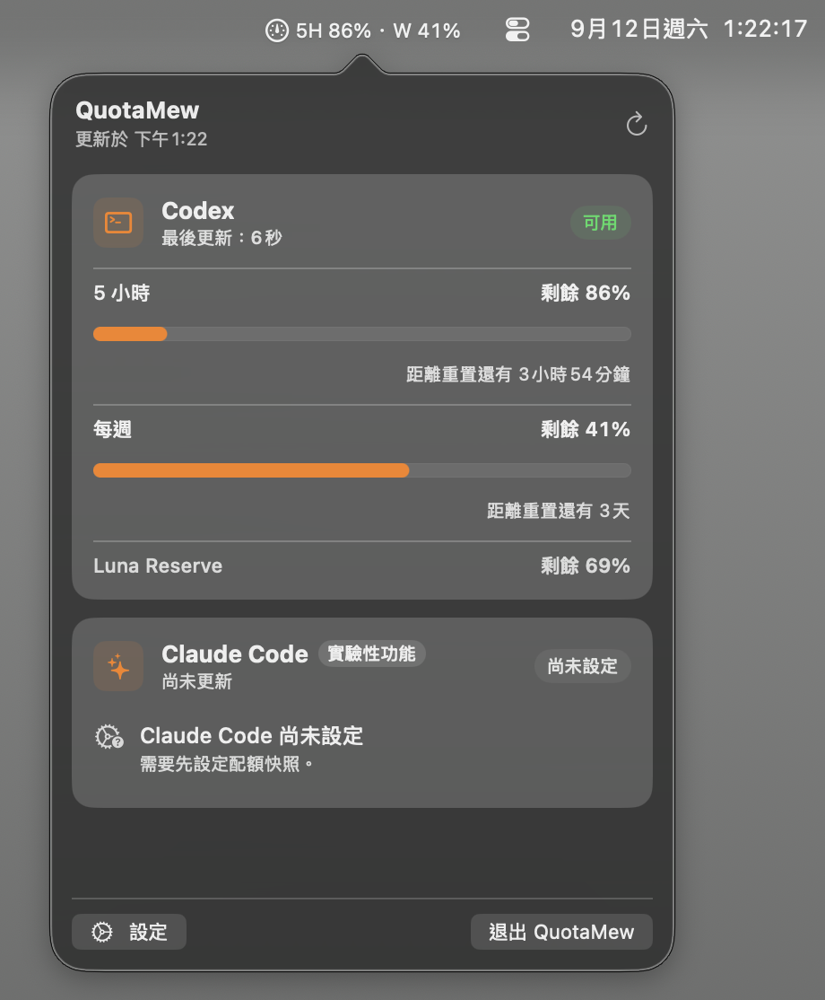
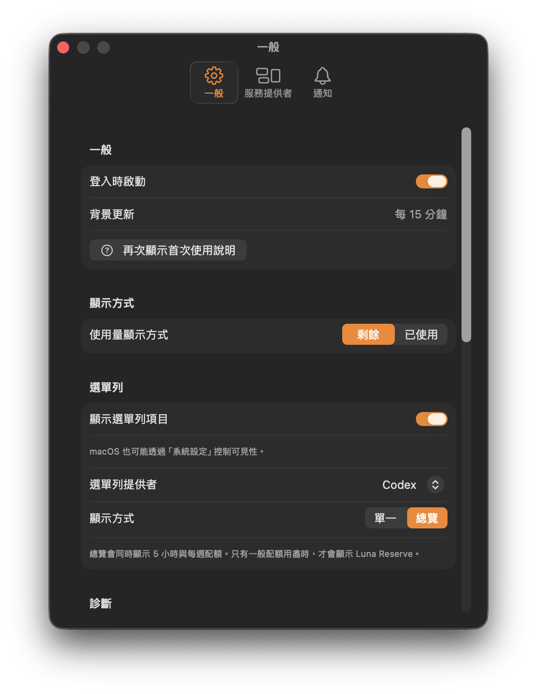
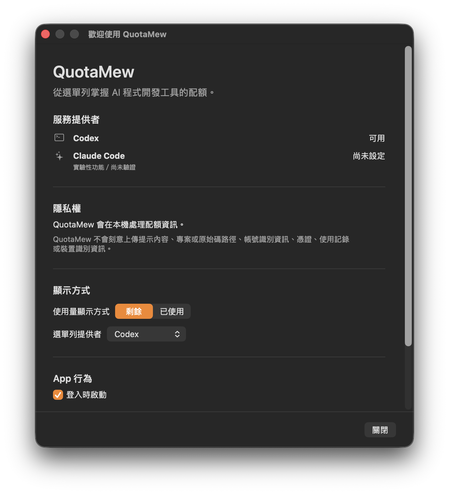

# QuotaMew

[English](README.md) | **繁體中文**

QuotaMew 是一款輕量、原生的 macOS 選單列工具，用來監看 AI 程式開發代理工具的額度用量與重設時間。

<p align="center">
  
</p>

QuotaMew 可直接在 macOS 選單列顯示 5 小時與每週配額，點開即可查看完整資訊。

## 文件

完整的安裝指南、隱私說明與疑難排解：

**https://quotamew.yincheng.app/zh-TW/docs**

## 為什麼需要 QuotaMew

不同程式開發代理工具的額度可能在不同時間重設。QuotaMew 讓目前用量百分比、重設時間與倒數只要點一下就能看到，不需要 QuotaMew 帳號或雲端服務。

## 功能

- 使用 Swift 與 SwiftUI 開發的原生 macOS 選單列 App
- Dashboard 與選單列可切換顯示剩餘／已使用額度
- 可設定選單列 Single／Overview 模式，以及 5H／W／R 精簡標籤
- 5 小時、每週與保守呈現的 Luna Reserve 額度
- 重設時間與分鐘級倒數
- 透過 macOS 通知提供本機重設提醒
- 精簡的「一般／服務提供者／通知」設定，可控制登入時啟動、選單列固定 provider、provider 啟用狀態與提醒門檻
- 不含私密資訊的相容性診斷，可複製適合貼到 GitHub Issue 的報告
- 英文與臺灣繁體中文本地化
- 為輕量長時間執行設計的保守刷新排程
- 隱私優先的本機處理，且沒有第三方 runtime 相依套件

「一般」設定集中呈現主要偏好：剩餘／已使用、固定在選單列的 Provider，以及 Single／Overview 顯示模式。

<p align="center">
  
</p>

## 支援的 providers

| Provider | 狀態 | 整合方式 |
| --- | --- | --- |
| Codex | **Supported** | 已使用 ChatGPT.app 內附的 Codex runtime 驗證；探索時也保留舊 Codex.app 與相容獨立 CLI 位置作為 fallback。 |
| Claude Code | **Experimental / Unverified** | 已實作有大小上限的本機 snapshot reader，但 opt-in status-line bridge 與符合資格之真實訂閱帳號驗證尚未完成。 |

ChatGPT.app 支援依賴未文件化的封裝細節：內附 Codex runtime 的路徑不是穩定的公開 contract。因此 ChatGPT 更新後，QuotaMew 可能需要相容性調整。

## 安裝

### 下載 Release Candidate

目前公開的 release candidate 為 **QuotaMew v0.2.0 RC.1**。Beta 1 以先前的 QuotaPulse 名稱發行，其歷史發行紀錄與產物保留原名。

請從 [QuotaMew v0.2.0-rc.1 Release](https://github.com/YinCheng0106/QuotaMew/releases/tag/v0.2.0-rc.1) 下載 `QuotaMew-v0.2.0-rc.1.dmg`。

1. 下載最新的 `.dmg`。
2. 開啟磁碟映像檔。
3. 將 QuotaMew 拖曳到 Applications（應用程式）資料夾。
4. 從 Applications 開啟 QuotaMew。

完整安裝與首次啟動方式請參閱 [QuotaMew 文件](https://quotamew.yincheng.app/zh-TW/docs/installation)。

首次啟動時，QuotaMew 會先介紹 Provider 狀態、本機隱私、顯示偏好與登入時啟動，再開始使用選單列 App。

<p align="center">
  
</p>

> 目前的 RC 使用 Apple Development 簽章，尚未使用 Apple Developer ID 完成簽署與公證；第一次開啟時 macOS 可能需要透過「系統設定 → 隱私權與安全性 → 仍要打開」額外核准。

### 從原始碼建置

需求：

- macOS 14 以上
- 含 Swift 6 toolchain 與 macOS 14 SDK 以上版本的 Xcode；v0.1.0 已使用 Xcode 26.6 驗證
- 若要使用目前已驗證的 Codex 即時整合，需要安裝 ChatGPT.app；單純編譯與啟動 App 不需要

Clone 並開啟專案：

```sh
git clone https://github.com/YinCheng0106/QuotaMew.git
cd QuotaMew
open QuotaMew.xcodeproj
```

產品與 repository 更名已完成；相容性敏感的內部識別碼刻意保留原命名空間。

在 Xcode 選擇 `QuotaMew` scheme 與 **My Mac**，再選擇 **Product → Run**。如果 Xcode 要求設定本機開發用 team，請在 Signing & Capabilities 選擇自己的 team；這不代表已完成散布用的 Developer ID 簽章。

對應的命令列建置指令為：

```sh
xcodebuild \
  -project QuotaMew.xcodeproj \
  -scheme QuotaMew \
  -destination 'platform=macOS,arch=arm64' \
  -configuration Debug \
  build
```

Debug build 使用獨立的 `dev.quotapulse.development.app` identity，並顯示為 **QuotaMew Debug**。這會讓開發期間的選單列 status-item persistence、登入時啟動、通知權限與 `UserDefaults` 狀態和 production `dev.quotapulse.app` identity 分開；兩個 configuration 刻意不共用偏好設定。

## Codex 整合方式

QuotaMew 會尋找相容的 Codex 執行檔，優先使用 ChatGPT.app 內附的 runtime，再 fallback 到支援的舊版或獨立安裝位置。它會直接啟動 `codex app-server`，並透過已有文件的 stdio protocol 呼叫 `account/rateLimits/read`。

驗證身分仍由 Codex 負責。QuotaMew 不會讀取或複製 `~/.codex/auth.json`、擷取互動式 `/status` 畫面，也不會掃描 Codex session history。Provider 資料經過正規化後才會交給 SwiftUI。

## 通知

取得新鮮的 provider 資料後，QuotaMew 會透過 macOS `UserNotifications` 在本機排定重設提醒。剩餘額度至少為 20% 時附上剩餘百分比，否則使用一般重設提醒。短額度視窗可在 1 小時與 30 分鐘前提醒；長視窗則可在門檻未超過視窗長度時，於 24 小時、6 小時與 1 小時前提醒。你可以在「設定」中關閉全部通知或個別門檻。

QuotaMew 也會在每次刷新後比對有上限的 normalized provider 狀態，判斷 quota window 是否真正進入新 cycle，並在該視窗完成重設時最多通知一次。單純 percentage 下降不計為 reset，persisted cycle identity 也會避免 App restart 後重複通知。官方外部 Reset Intelligence feed 仍是未來階段；詳見 [docs/RESET_INTELLIGENCE.md](docs/RESET_INTELLIGENCE.md)。

## 隱私

QuotaMew 在本機處理用量資料，不需要 QuotaMew 帳號、後端、分析服務或雲端同步。它的設計不會刻意上傳：

- prompt 或對話內容
- 原始碼或程式開發歷史
- 驗證憑證
- provider session 內容

使用 Codex 時，QuotaMew 只會向本機安裝的 runtime 傳送取得 rate-limit 資料所需的 app-server protocol request；該 runtime 仍依原本設計處理 provider 通訊與驗證。使用 Claude Code 時，目前實作的 reader 只接受小型、有版本的 legacy QuotaPulse 自有 snapshot，不會掃描 transcript、history、credential 或內部 usage cache。

以上描述的是 QuotaMew 的實作邊界，不會改變 ChatGPT、Codex、Claude Code、macOS 或 Mac 上其他軟體本身的隱私與網路行為。

## 效能理念

QuotaMew 優先採用事件驅動更新、保守的刷新週期、有上限的 process output，以及同一時間只進行一個合併後的刷新。倒數畫面本身不會觸發 provider request。

在開發機約一小時的測試中，QuotaMew 閒置記憶體維持在約 48 MB；開啟選單或「設定」時曾短暫到約 70 MB，刷新時則短暫增加約 10–20 MB，之後都會往基準值回落。觀察到的閒置 CPU 接近 0%。這些是單一開發環境的觀察結果，不是所有環境的保證；量測條件與限制請參閱 [docs/PERFORMANCE.md](docs/PERFORMANCE.md)。

## Provider 相容性疑難排解

如果 provider 用量變成無法取得，請開啟**「設定」→「診斷」**並選擇**「複製診斷資訊」**，再把英文報告貼到 GitHub Issue。報告只包含 allowlist 允許的版本、系統、provider、runtime、連線、刷新與 metadata 可用狀態；不包含憑證、prompt、session、專案資料、私密路徑、原始 provider 回應或實際額度百分比。

請勿附上原始 app-server output、Codex session 檔、驗證檔案或範圍過大的系統 log。

## 已知限制

- 需要 macOS 14 以上
- 已在 Apple silicon 驗證；Intel Mac 尚未驗證
- ChatGPT.app Codex runtime 探索依賴未文件化的 bundle 路徑
- Claude Code 支援為 Experimental / Unverified
- 目前 RC DMG 尚無 Developer ID 簽章與 Apple 公證
- 沒有用量歷史與雲端同步
- 沒有 iPhone App
- 尚未實作官方外部 Reset Intelligence feed 擷取

## Beta 3 選單列呈現

選單列可以在 Single 模式顯示一個指定額度，也可以在 Overview 模式同時顯示兩個一般額度視窗。`5H` 代表 5 小時額度，`W` 代表每週額度，`R` 代表 Luna Reserve。例如「剩餘」可能顯示為 `5H 86% · W 71%`；「已使用」則可能顯示為 `5H 14% · W 29%`。這些是呈現模式，不會改變 Provider 的額度資料。

Luna Reserve 是從 Codex 資料觀察到的額外額度 bucket，由 QuotaMew 以保守方式呈現。你可以在 Single 模式明確選擇它；Overview 只有在既有的顯示規則允許時才會顯示。QuotaMew 不會控制或啟用 Reserve，也不保證請求目前正經由 Reserve 路由。

## 路線圖

Beta 3 依精確的正規化 duration，讓 Dashboard、VoiceOver 與通知共用「**5 小時／每週**」名稱；未知長度採安全的通用名稱。**Luna Reserve** 平常以次要精簡列呈現，只有新鮮、有效的一般 Codex 視窗耗盡時才展開。這是顯示規則，不代表 Reserve 已啟用或保證可用；它不取代選單列的一般額度，也不發送重設通知。

左鍵維持切換 Dashboard；右鍵開啟原生選單，提供「**立即重新整理**」、「**設定…**」與「**退出 QuotaMew**」，沿用既有刷新、Settings scene 與正常結束流程。

Milestone A／B、Product Polish 與 **Milestone C — Onboarding** 已完成。RC.1 凍結 v0.2.0 功能範圍，專注於最終發行驗證與穩定性。外部 Reset Intelligence feed／network／matching 工作移至 v0.3。詳見 [v0.2 計畫](docs/V0_2_PLAN.md) 與[人工驗收清單](docs/RUNTIME_TESTING.md#v02-product-polish-acceptance)。

QuotaMew 現已包含本機 reset-cycle detection。未來可能進行經審查的 Claude Code opt-in bridge、更廣泛的 provider 與硬體驗證、簽章與 notarization，以及保留來源連結的官方 Reset Intelligence feed 擷取；這些未來項目都不是目前已實作功能。詳情請參閱 [ROADMAP.md](ROADMAP.md)。

## 參與貢獻

歡迎範圍明確的貢獻。送出 pull request 前，請先閱讀 [CONTRIBUTING.md](CONTRIBUTING.md)、[SECURITY.md](SECURITY.md) 與 [ARCHITECTURE.md](ARCHITECTURE.md)。

## 授權

QuotaMew 採用 [MIT License](LICENSE) 授權。
